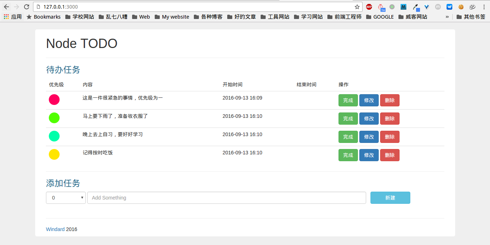
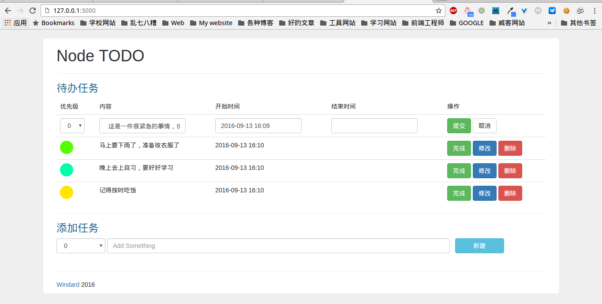
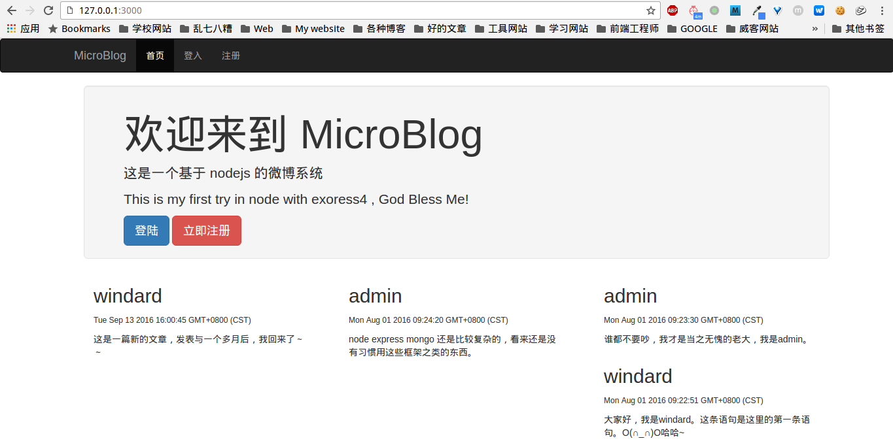
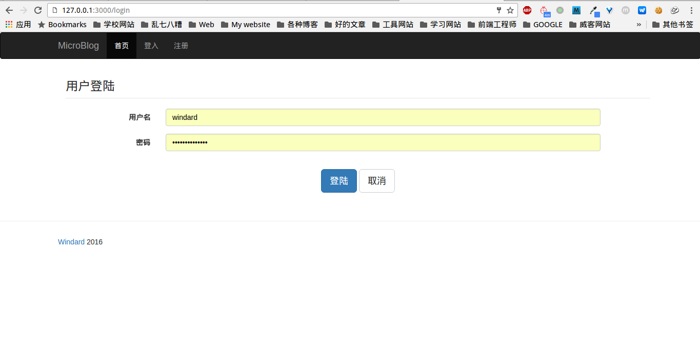
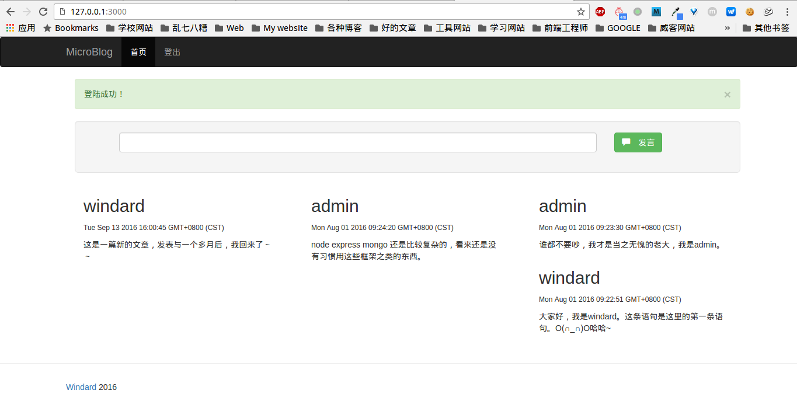

## This is my node code

### nodo-todo

express 4.x + mysql + bootstrap 的 todo

```
npm i
npm start
```





### microblog

这是按照 《node 权威指南》 上的代码进行了修改移植到了 express 4.x 上

```
npm i
npm start
```






